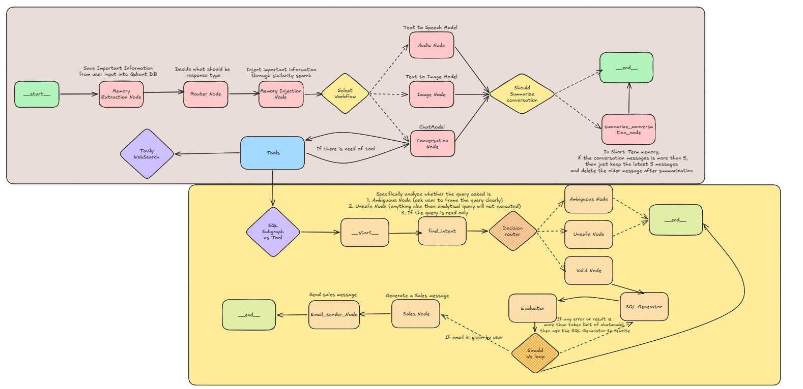

        
    <h1 align="center">📱 Ava 📱</h1>
    <h3 align="center">Turning the Turing Test into a WhatsApp Agent</h3>

    

## Project Overview

### Ava: A WhatsApp Agent Inspired by *Ex Machina*

Ava is a WhatsApp agent designed to engage with users in a "realistic" way, inspired by the film *Ex Machina*. While you won't find a fully sentient robot here, you will experience engaging conversations. Ava also features the capability to generate and execute SQL queries and send professional sales emails.

#### Key Implementation Features:

* **Fully Functional WhatsApp Agent:** Built a chat-ready agent accessible from any phone.
* **LangGraph Workflows:** Developed complex agentic behaviors using LangGraph.
* **Long-Term Memory:** Integrated a memory system using Qdrant as a Vector Database.
* **High-Performance AI:** Powered agent responses and STT (Speech-to-Text) systems using Groq models.
* **TTS Integration:** Implemented Text-to-Speech using ElevenLabs.
* **Multimodal Capabilities:** Generated high-quality images with FLUX diffusion models and processed visual data using Llama-3.2-vision.
* **WhatsApp API Integration:** Connected agentic applications directly to the WhatsApp API.
* **NL2SQL Workflow:** Added a Multi-Agent workflow for Natural Language to SQL generation and execution.
* **Sales Automation:** Integrated a Sales Agent to automate marketing emails.

---

## The tech stack

<table>
  <tr>
    <th>Technology</th>
    <th>Description</th>
  </tr>
  <tr>
    <td></td>
    <td>Powering the project with Groq models (free & fast)</td>
  </tr>
  <tr>
    <td></td>
    <td>Serving as the long-term database, enabling our agent to recall details you shared months ago.</td>
  </tr>
  <tr>
    <td></td>
    <td>build production-ready LangGraph workflows</td>
  </tr>
  <tr>
    <td></td>
    <td>Used Open source model for image generation</td>
  </tr>
  <tr>
    <td></td>
    <td>Amazing TTS models</td>
  </tr>
  <tr>
    <td></td>
    <td>For Obersability and debugging</td>
  </tr>
</table>

---

## LangGraph (The Core) Workflow Diagram

    

