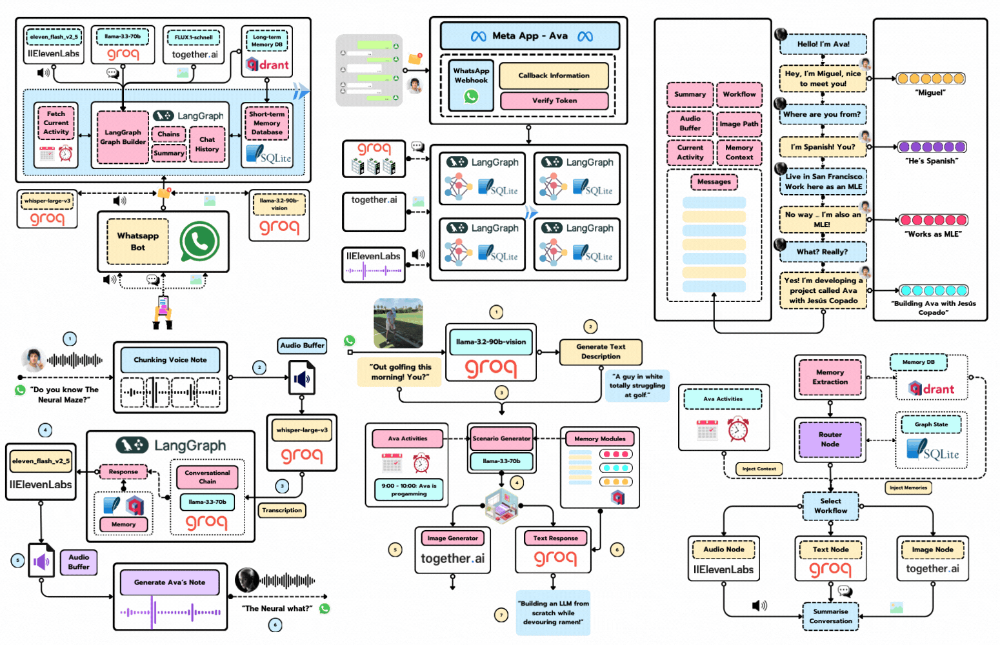
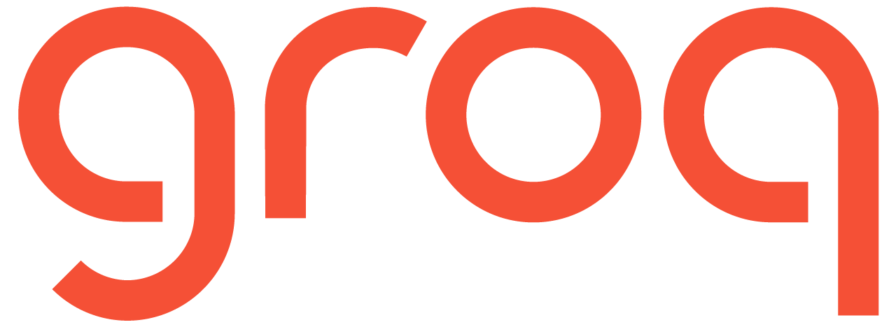
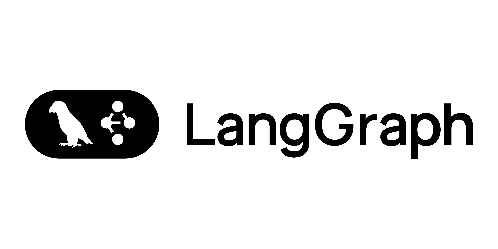
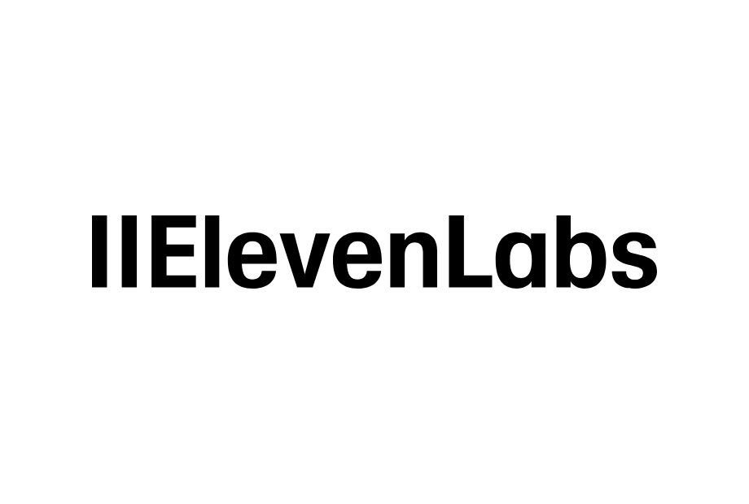

        
    <h1 align="center">📱 Ava 📱</h1>
    <h3 align="center">Turning the Turing Test into a WhatsApp Agent</h3>

    

## Project Overview

**Ava**, a Whatsapp agent that can engage with users in a "realistic" way, inspired by the great film [Ex Machina](https://www.imdb.com/es-es/title/tt0470752/). Ok, you won't find a fully sentient robot here, but you **will** have some pretty interesting Whatsapp conversations also have capability of generating and executing SQL queries and send sales mail.

## What I have Implemented in this project.

* Build a fully working WhatsApp agent you can chat with on any phone.
* build LangGraph workflows.
* Set up a long-term memory system using Qdrant as a Vector Database
* Use Groq models to power AI Agent responses
* Implement STT systems using Groq
* Implement TTS systems using ElevenLabs
* Generate high-quality images using diffusion models, like FLUX models
* Process images using VLM models, like llama-3.2-vision
* Connect agentic applications to the WhatsApp API
* Add Natrual language to SQL Generation and Execution Multi Agent workflow
* Add Sales Agent to send the marketing email.

---

## The tech stack

<table>
  <tr>
    <th>Technology</th>
    <th>Description</th>
  </tr>
  <tr>
    <td></td>
    <td>Powering the project with Groq models (free & fast)</td>
  </tr>
  <tr>
    <td></td>
    <td>Serving as the long-term database, enabling our agent to recall details you shared months ago.</td>
  </tr>
  <tr>
    <td></td>
    <td>build production-ready LangGraph workflows</td>
  </tr>
  <tr>
    <td></td>
    <td>Used Open source model for image generation</td>
  </tr>
  <tr>
    <td></td>
    <td>Amazing TTS models</td>
  </tr>
  <tr>
    <td></td>
    <td>For Obersability and debugging</td>
  </tr>
</table>

---
